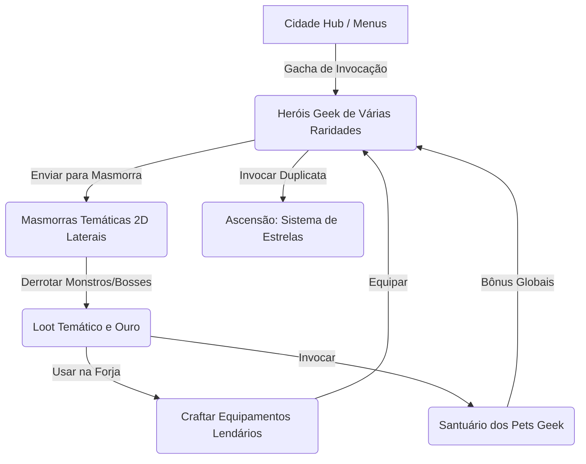

# Game Design Document (GDD): Geek Pixel Idle

**Geek Pixel Idle** é um jogo de RPG Idle (incremental) em 2D Lateral (Side-scroller) focado no crossover de personagens icônicos da cultura pop, animes, filmes, desenhos e séries. O jogador gerencia uma guilda de heróis lendários invocados via gacha interdimensional, envia-os para masmorras temáticas para obter recursos exclusivos e os fortalece na Forja usando equipamentos icônicos de cada universo.

---

## 1. Visão Geral e Conceito do Jogo

### Diferenciais do Projeto:
1. **Colecionismo de Cultura Pop:** Personagens famosos (Naruto, Goku, Vader, Harry Potter) substituem heróis genéricos.
2. **Sistema Gacha de Heróis:** Heróis são invocados aleatoriamente em portais de invocação com diferentes chances de drop baseados na sua importância/raridade.
3. **Combate 2D Lateral Dinâmico:** Foco em combates de rolagem lateral com efeitos de poderes marcantes.
4. **Cidade sem Grid (Foco em UI):** Sem simulação física de construção. A cidade funciona como um painel hub estático bonito que abre modais de controle (Forja, Santuário, Taverna).
5. **Sprites Eficientes:** Cada personagem precisa de apenas 1 spritesheet lateral espelhado pelo código para a esquerda, economizando cota de imagens geradas por IA.

---

## 2. O Sistema Gacha e Raridades de Heróis

Na Taverna Multiverso, o recrutamento direto é substituído por um **Portal de Invocação Dimensional** usando Ouro.

### Tabela de Raridades de Heróis:

| Raridade | Tipo de Personagem | Peso / Chance | Exemplos de Personagens | Bônus Base de Atributo |
|---|---|---|---|---|
| **Comum / Suporte** | Coadjuvantes, ajudantes ou personagens secundários | **70%** | Krilin, Yamcha, Sakura Haruno, Stormtrooper Renegado, Ron Weasley | Atributos Base Normais |
| **Raro / Importante** | Personagens fortes com relevância na trama | **25%** | Sasuke Uchiha, Vegeta, Obi-Wan Kenobi, Hermione Granger | +30% Atributos Base |
| **Lendário / Protagonistas** | Personagens principais e vilões icônicos | **5%** | Goku, Naruto Uzumaki, Darth Vader, Harry Potter | +70% Atributos Base e Habilidade Única Avançada |

### Mecânica de Duplicatas (Ascensão por Estrelas):
Se o jogador invocar um herói que ele já possui na guilda:
* O herói **não é duplicado na lista**, mas sim **Ascendido** (ganha +1 Estrela).
* Cada Estrela adicional concede um bônus multiplicador permanente de **+20% de ATK e HP** para aquele herói (máximo de 5 Estrelas).
* Isso garante que todas as invocações repetidas no Gacha sejam úteis e fortaleçam a guilda.

---

## 3. Masmorras Temáticas (Biomas e Progressão)

Cada masmorra representa um universo geek. O jogador coleta recursos únicos para criar equipamentos do mesmo tema da masmorra.

| Nível | Tema / Masmorra | Herói Lendário de Destaque | Inimigos Comuns | Chefe Final (Boss) | Recursos de Drop | Itens Fabricáveis na Forja |
|---|---|---|---|---|---|---|
| **T1** | **Vila da Folha** (Naruto) | Naruto Uzumaki | Ninjas da Névoa, Saibamens | Orochimaru | Bandana Velha, Pergaminho, Linhas de Chakra | Kunai, Shuriken, Colete Chunin |
| **T2** | **Planeta Namekusei** (Dragon Ball) | Goku | Soldados do Freeza, Saibamens | Imperador Freeza | Minério Katchin, Esfera de Ki, Cauda Saiyajin | Bastão Mágico, Armadura Saiyajin |
| **T3** | **Estrela da Morte** (Star Wars) | Luke Skywalker | Stormtroopers, Droids imperiais | Darth Vader | Cristal Kyber, Sucata Imperial, Placa de Beskar | Sabre de Luz, Blaster DL-44, Elmo Mandaloriano |
| **T4** | **Castelo da Magia** (Harry Potter) | Harry Potter | Comensais da Morte, Dementadores | Lord Voldemort | Pena de Fênix, Madeira de Varinhagem, Caldeirão | Varinha das Varinhas, Capa da Invisibilidade |

---

## 4. Estrutura do Hub da Cidade (Menus e Modais)

A cidade não possui grid físico. Ela é uma tela de fundo estática premium (ilustrando uma "Base Multiverso") contendo ícones interativos. Ao clicar neles, modais responsivos são abertos na tela:

* **Taverna Multiverso (Portal Gacha):**
  * Onde o jogador realiza as invocações de heróis pagando Ouro (ex: **1.000 Ouro** por invocação).
  * Exibe uma animação estilizada ao tirar um novo herói (com cores diferentes baseadas na raridade: Cinza, Azul, Dourado).
* **Forja Ancestral (Crafting Modal):**
  * Interface limpa que lista as receitas liberadas. O jogador usa materiais coletados nas masmorras temáticas + ouro para criar e equipar armas e armaduras exclusivas de cada franquia.
* **Santuário das Criaturas (Pet Summoning Modal):**
  * Invocação (Gacha) de pets geek (ex: Pikachu, Baby Yoda/Grogu, Chopper, Kurama).
  * O custo por invocação é de **500 Ouro**. O gacha roda com a chance ponderada original por raridade (Comum 60%, Incomum 25%, Raro 12%, Lendário 3%).
* **Portal de Masmorras (Biome Selection Modal):**
  * Onde o jogador escolhe qual masmorra os heróis estão atacando no momento. Cada masmorra exige um número mínimo de abates do chefe anterior para ser desbloqueada.

---

## 5. O Sistema de Combate 2D Lateral

* **Movimentação:** Os heróis andam de forma autônoma da esquerda para a direita na masmorra.
* **Inimigos:** Os inimigos surgem na borda direita e avançam em direção aos heróis.
* **Combate:** Quando entram em alcance, atacam. O combate usa física de colisão 2D linear.
* **Habilidades Especiais:**
  * Cada herói recarrega uma barra de energia/cooldown e dispara um golpe característico com animações marcantes (ex: Goku lança um projétil azul brilhante *Kamehameha* que atravessa os inimigos na linha horizontal).
* **Dano e Morte:** Ao receberem dano, monstros mostram flash de cor vermelha e encolhimento. Ao morrerem, caem de lado e evaporam em fumaça de partículas.

---

## 6. Roteiro de Desenvolvimento (Roadmap)

### Fase 1: Setup do Projeto e Hub da Cidade
* [x] Inicializar o projeto no diretório `C:\Users\t31229\Desktop\Geek Pixel Idle` (Feito pelo Claude).
* [x] Criar estrutura base de arquivos (`index.html`, `src/main.js`, `styles/main.css`).
* [ ] Implementar a UI do Hub da Cidade (fundo premium de masmorra interdimensional com botões estilizados abrindo modais).
* [ ] Programar os Modais: Gacha de Heróis e Santuário de Pets.

### Fase 2: Lógica Central do Jogo (Engine)
* [ ] Criar classe `Hero` adaptada para 2D lateral (stats de combate, inventário de loots temáticos, cooldowns de habilidades, sistema de Ascensão/Estrelas por duplicata).
* [ ] Criar classe `Monster` 2D lateral e `MonsterSpawner` (gerenciador de masmorras).
* [ ] Implementar o motor de física 2D simples e combate linear na tela de caça.

### Fase 3: Geração de Sprites Geek e Processamento por IA
* [ ] Criar novo compilador de spritesheets laterais (`compile_geek_sprite.mjs`) que converte tiras lineares 2D geradas por IA (caminhada + ataque de lado) para o spritesheet de combate.
* [ ] Gerar imagens de heróis icônicos (Naruto, Goku, Luke) com IA.
* [ ] Gerar imagens de monstros temáticos (Stormtroopers, Soldados do Freeza) com IA.

### Fase 4: Forja Temática e Progressão de Masmorras
* [ ] Implementar a Forja com receitas temáticas T1-T5.
* [ ] Configurar os biomas das masmorras e balancear a progressão de dificuldade.
* [ ] Implementar efeitos visuais de magias e projéteis (Kamehameha, sabre de luz, etc.) no renderizador.
