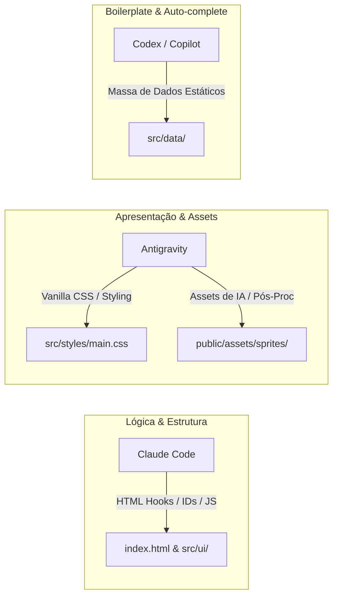

# Framework de Trabalho (v2): Divisão de Tarefas entre Agentes de IA

Para maximizar a produtividade e **eliminar conflitos de código** no desenvolvimento do **Geek Pixel Idle**, estabelecemos um contrato claro de divisão de responsabilidades. O HTML atua como a interface/contrato entre a lógica do jogo (Claude Code) e a apresentação visual (Antigravity).

---

## 🤝 O Contrato de Divisão de Responsabilidades

---

## 🤖 1. Antigravity (Eu)
* **Foco:** Estética Visual (CSS), Identidade de Design (Aesthetics) e Asset Pipeline (Imagens).
* **Minhas Entregas:**
  * **Geração de Assets com IA:** Criação de spritesheets 4x4, imagens de masmorras e ícones de itens geek usando a ferramenta nativa `generate_image`.
  * **Remoção de Fundo e Pós-Processamento:** Aplicação de scripts (`make_transparent.mjs`, `compile_monster.mjs`) para converter tiras 2D em spritesheets prontos.
  * **Folha de Estilos Pura (`src/styles/main.css`):** Customização de cores, tipografia, efeitos de luz (glow), modais (glassmorphism), animações de transição e responsividade.
* **⚠️ Regra de Ouro:** Não altero IDs ou classes estruturais no HTML. Eu estilizo o que o Claude Code disponibilizar na marcação.

---

## 🧠 2. Claude Code
* **Foco:** Arquitetura do Motor, Lógica de Estado (State) e Contrato de UI (HTML).
* **Entregas do Claude Code:**
  * **Estrutura HTML (`index.html` & templates dinâmicos):** Garante a criação estável dos IDs e seletores (ex: `id="phaser-container"`, `onclick="hireHero(...)"`).
  * **Engine e Física 2D (Phaser / JS):** Configuração do Phaser, loop de combate, física de combate, efeitos de habilidades dos heróis de animes.
  * **Lógica dos Modais (`src/ui/`):** Lógica em JS que abre e fecha os modais e consome o estado global (`state.js`).
  * **Sistemas e Fórmulas:** Salvamento local, balanceamento de XP, gacha de heróis por raridade e gacha de pets.

---

## ⚡ 3. Codex / GitHub Copilot (Auto-Complete no Editor)
* **Foco:** Entrada de dados estáticos em massa e auxílio de digitação instantâneo.
* **Entregas do Codex:**
  * **Preenchimento de Banco de Dados (`src/data/`):** Listas imensas com 50+ monstros, centenas de receitas de armas na forja e configurações de masmorras.
  * **Documentação JSDoc** e boilerplates repetitivos.
